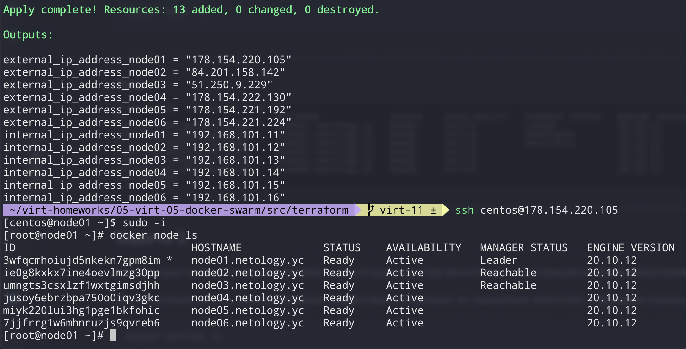
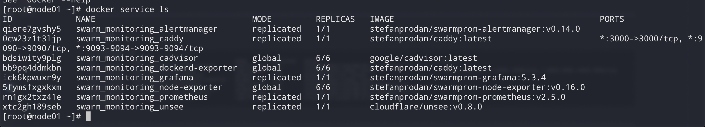

# Домашнее задание к занятию "5.5. Оркестрация кластером Docker контейнеров на примере Docker Swarm"

    
## Задача 1


В чём отличие режимов работы сервисов в Docker Swarm кластере: replication и global?
* В режиме replicated приложение запускается в том количестве экземпляров, какое укажет пользователь. При этом на отдельной ноде может быть как несколько экземпляров приложения, так и не быть совсем.В режиме global приложение запускается обязательно на каждой ноде и в единственном экземпляре.

Какой алгоритм выбора лидера используется в Docker Swarm кластере?
В Docker Swarm кластере используется алгоритм выбора лидера Raft. Он имеет ряд приемуществ:
* разделение крупных задач до мелких
* явно выделенный лидер. т.е. лидер в текущий момент времени может быть только один
* протоколы работы не содержат пропусков, т.е. записи добавляются строго последовательно
* изменение размера кластера без перезапуска

Что такое Overlay Network?
* L2 VPN сеть для связи демонов Docker между собой. В основе используется технология vxlan

## Задача 2

Создать ваш первый Docker Swarm кластер в Яндекс.Облаке

####Cкриншот из терминала (консоли), с выводом команды:
```
docker node ls
```



## Задача 3

Создать ваш первый, готовый к боевой эксплуатации кластер мониторинга, состоящий из стека микросервисов.

#####Cкриншот из терминала (консоли), с выводом команды:
```
docker service ls
```

