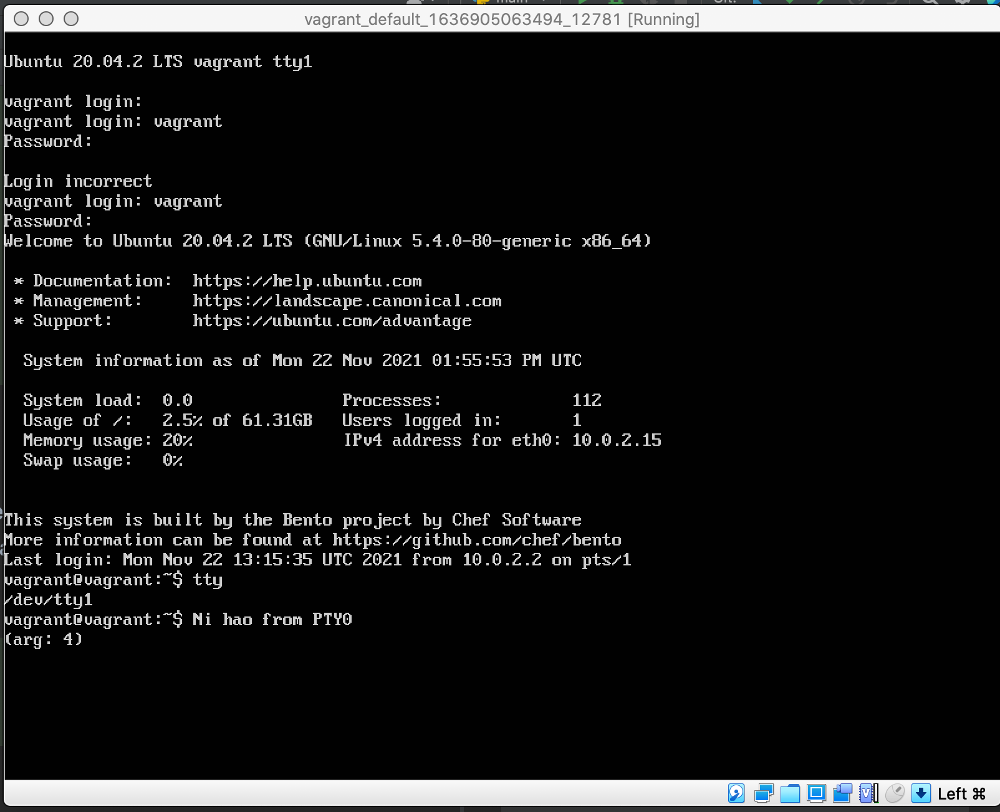

# Домашнее задание к занятию "3.2. Работа в терминале, лекция 2"

1. Какого типа команда `cd`? Попробуйте объяснить, почему она именно такого типа; опишите ход своих мыслей, если считаете что она могла бы быть другого типа.

`cd` - команда, которая встроена непосредственно в Bash. Команды делаются встроенными либо из соображений производительности - встроенные команды исполняются быстрее, чем внешние, которые, как правило, запускаются в дочернем процессе, либо из-за необходимости прямого доступа к внутренним структурам командного интерпретатора. Встроенные команды Bash, не порождают новый подпроцесс, в то время как вызов внешних команд, как правило, приводит к созданию нового подпроцесса.

2. Какая альтернатива без pipe команде `grep <some_string> <some_file> | wc -l`? `man grep` поможет в ответе на этот вопрос. Ознакомьтесь с [документом](http://www.smallo.ruhr.de/award.html) о других подобных некорректных вариантах использования pipe.

```buildoutcfg
vagrant@vagrant:~$ grep -c 'AppArmor' /var/log/syslog
66
```


3. Какой процесс с PID `1` является родителем для всех процессов в вашей виртуальной машине Ubuntu 20.04?

```buildoutcfg
vagrant@vagrant:~$ pstree -p
systemd(1)─┬─VBoxService(771)─┬─{VBoxService}(772)
           │                  ├─{VBoxService}(773)
           │                  ├─{VBoxService}(774)
           │                  ├─{VBoxService}(775)
           │                  ├─{VBoxService}(776)
           │                  ├─{VBoxService}(777)
           │                  ├─{VBoxService}(778)
           │                  └─{VBoxService}(779)
           ├─accounts-daemon(576)─┬─{accounts-daemon}(580)
           │                      └─{accounts-daemon}(629)
           ├─agetty(806)
           ├─atd(799)
           ├─cron(793)
           ...
```

4. Как будет выглядеть команда, которая перенаправит вывод stderr `ls` на другую сессию терминала?

```buildoutcfg
vagrant@vagrant:~$ tty
/dev/pts/0
vagrant@vagrant:~$ ls -z 2> /dev/pts/1
vagrant@vagrant:~$
```
```buildoutcfg
vagrant@vagrant:~$ tty
/dev/pts/1
vagrant@vagrant:~$ ls: invalid option -- 'z'
Try 'ls --help' for more information.
```

5. Получится ли одновременно передать команде файл на stdin и вывести ее stdout в другой файл? Приведите работающий пример.

```buildoutcfg
vagrant@vagrant:~$ cat > file1
063
008
239
vagrant@vagrant:~$ sort < file1 > file2
vagrant@vagrant:~$ cat file2
008
063
239
vagrant@vagrant:~$
```

6. Получится ли вывести находясь в графическом режиме данные из PTY в какой-либо из эмуляторов TTY? Сможете ли вы наблюдать выводимые данные?

```buildoutcfg
root@vagrant:~# tty
/dev/pts/0
root@vagrant:~# echo "Ni hao from PTY0" > /dev/tty1
root@vagrant:~#
```




7. Выполните команду `bash 5>&1`. К чему она приведет? Что будет, если вы выполните `echo netology > /proc/$$/fd/5`? Почему так происходит?

```buildoutcfg
vagrant@vagrant:~$ bash 5>&1
vagrant@vagrant:~$ echo netology > /proc/$$/fd/5
netology
```
Вывод в файл с дескриптором 5 передается в файл с дескриптором 1 (stdout).
Команда `echo netology > /proc/$$/fd/5` выводит в дескриптор "5", который был пернеаправлен в stdout.


8. Получится ли в качестве входного потока для pipe использовать только stderr команды, не потеряв при этом отображение stdout на pty? Напоминаем: по умолчанию через pipe передается только stdout команды слева от `|` на stdin команды справа.
Это можно сделать, поменяв стандартные потоки местами через промежуточный новый дескриптор, который вы научились создавать в предыдущем вопросе.

```buildoutcfg
vagrant@vagrant:~$ ll /vagrant/ /root/ /root/  3>&2 2>&1 1>&3 | grep cannot -c
/vagrant/:
total 12
drwxr-xr-x  1 vagrant vagrant  160 Nov 11 18:16 ./
drwxr-xr-x 20 root    root    4096 Nov 14 15:57 ../
drwxr-xr-x  1 vagrant vagrant  128 Nov 11 18:16 .vagrant/
-rw-r--r--  1 vagrant vagrant   81 Nov 11 18:15 Vagrantfile
-rw-r--r--  1 vagrant vagrant 3010 Nov 11 18:13 Vagrantfile.bak
2
```

9. Что выведет команда `cat /proc/$$/environ`? Как еще можно получить аналогичный по содержанию вывод?

Переменные окружения текущего процесса `bash`. Так же `printenv` и `env`

10. Используя `man`, опишите что доступно по адресам `/proc/<PID>/cmdline`, `/proc/<PID>/exe`.

`/proc/<PID>/cmdline` - в этом файле хранится командная строка, которой был запущен данный процесс;
`/proc/<PID>/exe` - представляет собой символическую ссылку на исполняемый файл, который инициировал запуск процесса;

11. Узнайте, какую наиболее старшую версию набора инструкций SSE поддерживает ваш процессор с помощью `/proc/cpuinfo`.

`sse4_2`

```buildoutcfg
vagrant@vagrant:~$ grep sse /proc/cpuinfo
```


12. При открытии нового окна терминала и `vagrant ssh` создается новая сессия и выделяется pty. Это можно подтвердить командой `tty`, которая упоминалась в лекции 3.2. Однако:

     ```bash
     vagrant@netology1:~$ ssh localhost 'tty'
     not a tty
     ```

     Почитайте, почему так происходит, и как изменить поведение.

По умолчанию, когда вы запускаете команду на удаленном компьютере с помощью ssh, TTY не выделяется для удаленного сеанса. Это позволяет передавать двоичные данные и т.д., без задействования TTY. Можно использовать ключ `-t` для принудительного выделения TTY во время удаленного выполнения с помощью ssh.


13. Бывает, что есть необходимость переместить запущенный процесс из одной сессии в другую. Попробуйте сделать это, воспользовавшись `reptyr`. Например, так можно перенести в `screen` процесс, который вы запустили по ошибке в обычной SSH-сессии.

```buildoutcfg
vagrant@vagrant:~$ tty
/dev/pts/2
vagrant@vagrant:~$ w
 13:39:59 up 22 min,  2 users,  load average: 0.00, 0.01, 0.00
USER     TTY      FROM             LOGIN@   IDLE   JCPU   PCPU WHAT
vagrant  pts/0    10.0.2.2         13:39   47.00s  0.00s  0.00s -bash
vagrant  pts/2    10.0.2.2         13:36    3.00s  0.01s  0.00s w
vagrant@vagrant:~$ man screen
SCREEN(1)                                                 General Commands Manual                                                 SCREEN(1)

NAME
       screen - screen manager with VT100/ANSI terminal emulation

SYNOPSIS
       screen [ -options ] [ cmd [ args ] ]
       screen -r [[pid.]tty[.host]]
       screen -r sessionowner/[[pid.]tty[.host]]
       ....
```

```buildoutcfg
vagrant@vagrant:~$ tty
/dev/pts/0
vagrant@vagrant:~$ w
 13:40:09 up 22 min,  2 users,  load average: 0.00, 0.01, 0.00
USER     TTY      FROM             LOGIN@   IDLE   JCPU   PCPU WHAT
vagrant  pts/0    10.0.2.2         13:39    0.00s  0.00s  0.00s w
vagrant  pts/2    10.0.2.2         13:36   13.00s  0.01s  0.01s -bash
vagrant@vagrant:~$ screen
vagrant@vagrant:~$ ps uxf
USER         PID %CPU %MEM    VSZ   RSS TTY      STAT START   TIME COMMAND
vagrant     1476  0.0  0.6  13956  6204 ?        S    13:39   0:00 sshd: vagrant@pts/0
vagrant     1477  0.0  0.4   9968  4276 pts/0    Ss   13:39   0:00  \_ -bash
vagrant     1509  0.0  0.3   9420  3028 pts/0    S+   13:41   0:00      \_ screen
vagrant     1510  0.0  0.2   9712  2652 ?        Ss   13:41   0:00          \_ SCREEN
vagrant     1511  0.0  0.4   9836  4100 pts/1    Ss   13:41   0:00              \_ /bin/bash
vagrant     1518  0.0  0.3  11492  3320 pts/1    R+   13:42   0:00                  \_ ps uxf
vagrant     1404  0.0  0.6  13932  6224 ?        S    13:36   0:00 sshd: vagrant@pts/2
vagrant     1405  0.0  0.4   9968  4328 pts/2    Ss   13:36   0:00  \_ -bash
vagrant     1491  0.0  0.3   9920  3964 pts/2    S+   13:40   0:00      \_ man screen
vagrant     1500  0.0  0.1   9656  1048 pts/2    S+   13:40   0:00          \_ man screen
vagrant     1501  0.0  0.2   8436  2316 pts/2    S+   13:40   0:00          \_ pager
vagrant      993  0.0  0.9  18376  9520 ?        Ss   13:18   0:00 /lib/systemd/systemd --user
vagrant      994  0.0  0.3 103056  3228 ?        S    13:18   0:00  \_ (sd-pam)
vagrant@vagrant:~$ sudo reptyr -T 1405
              screen emacs prog.c

       from a shell prompt within a previously created window.  This will not run another copy of screen, but will instead supply the  com‐
       mand  name  and  its  arguments to the window manager (specified in the $STY environment variable) who will use it to create the new
       window.  The above example would start the emacs editor (editing prog.c) and switch to its window. - Note that you cannot  transport
       environment  variables  from the invoking shell to the application (emacs in this case), because it is forked from the parent screen
       process, not from the invoking shell.

 Manual page screen(1) line 9 (press h for help or q to quit)
 ....
```

14. `sudo echo string > /root/new_file` не даст выполнить перенаправление под обычным пользователем, так как перенаправлением занимается процесс shell'а, который запущен без `sudo` под вашим пользователем. Для решения данной проблемы можно использовать конструкцию `echo string | sudo tee /root/new_file`. Узнайте что делает команда `tee` и почему в отличие от `sudo echo` команда с `sudo tee` будет работать.

Команда `tee` читает из стандартного ввода и записывает как в стандартный вывод, так и в один или несколько файлов одновременно.
Использование `tee` в сочетании с `sudo` позволяет записывать файлы, принадлежащие другим пользователям.