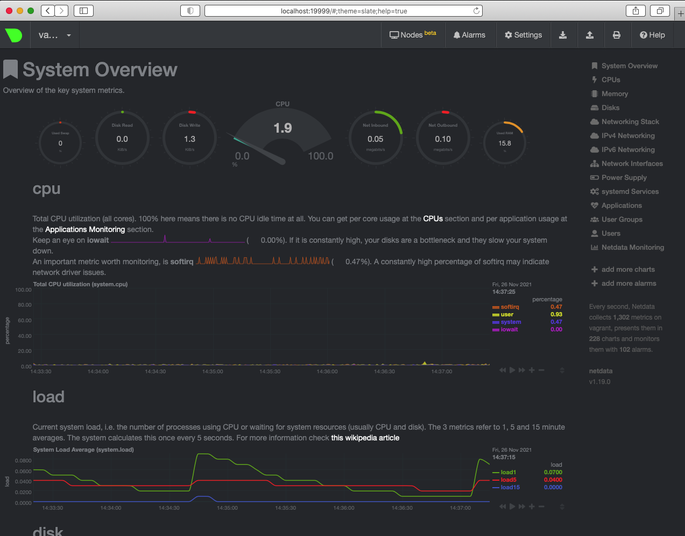

# Домашнее задание к занятию "3.4. Операционные системы, лекция 2"

1. На лекции мы познакомились с [node_exporter](https://github.com/prometheus/node_exporter/releases). В демонстрации его исполняемый файл запускался в background. Этого достаточно для демо, но не для настоящей production-системы, где процессы должны находиться под внешним управлением. Используя знания из лекции по systemd, создайте самостоятельно простой [unit-файл](https://www.freedesktop.org/software/systemd/man/systemd.service.html) для node_exporter:

    * поместите его в автозагрузку,
    * предусмотрите возможность добавления опций к запускаемому процессу через внешний файл (посмотрите, например, на `systemctl cat cron`),
    * удостоверьтесь, что с помощью systemctl процесс корректно стартует, завершается, а после перезагрузки автоматически поднимается.

```buildoutcfg
root@vagrant:~# systemctl cat node_exporter
# /etc/systemd/system/node_exporter.service
[Unit]
Description=Node Exporter
After=network.target

[Service]
User=node_exporter
Group=node_exporter
Type=simple
EnvironmentFile=-/etc/default/node_exporter
ExecStart=/usr/local/bin/node_exporter
ExecStop=/usr/local/bin/node_exporter
ExecRestart=/usr/local/bin/node_exporter
Restart=always

[Install]
WantedBy=multi-user.target
```

```buildoutcfg
root@vagrant:~# systemctl status node_exporter
● node_exporter.service - Node Exporter
     Loaded: loaded (/etc/systemd/system/node_exporter.service; enabled; vendor preset: enabled)
     Active: active (running) since Thu 2021-11-25 21:10:01 UTC; 8s ago
   Main PID: 1594 (node_exporter)
      Tasks: 7 (limit: 1071)
     Memory: 2.6M
     CGroup: /system.slice/node_exporter.service
             └─1594 /usr/local/bin/node_exporter

Nov 25 21:10:01 vagrant node_exporter[1594]: ts=2021-11-25T21:10:01.730Z caller=node_exporter.go:115 level=info collector=thermal_zone
Nov 25 21:10:01 vagrant node_exporter[1594]: ts=2021-11-25T21:10:01.730Z caller=node_exporter.go:115 level=info collector=time
Nov 25 21:10:01 vagrant node_exporter[1594]: ts=2021-11-25T21:10:01.730Z caller=node_exporter.go:115 level=info collector=timex
Nov 25 21:10:01 vagrant node_exporter[1594]: ts=2021-11-25T21:10:01.730Z caller=node_exporter.go:115 level=info collector=udp_queues
Nov 25 21:10:01 vagrant node_exporter[1594]: ts=2021-11-25T21:10:01.730Z caller=node_exporter.go:115 level=info collector=uname
Nov 25 21:10:01 vagrant node_exporter[1594]: ts=2021-11-25T21:10:01.730Z caller=node_exporter.go:115 level=info collector=vmstat
Nov 25 21:10:01 vagrant node_exporter[1594]: ts=2021-11-25T21:10:01.730Z caller=node_exporter.go:115 level=info collector=xfs
Nov 25 21:10:01 vagrant node_exporter[1594]: ts=2021-11-25T21:10:01.730Z caller=node_exporter.go:115 level=info collector=zfs
Nov 25 21:10:01 vagrant node_exporter[1594]: ts=2021-11-25T21:10:01.730Z caller=node_exporter.go:199 level=info msg="Listening on" address=:91>
Nov 25 21:10:01 vagrant node_exporter[1594]: ts=2021-11-25T21:10:01.731Z caller=tls_config.go:195 level=info msg="TLS is disabled." http2=false
```
Дополнительные опции в службу будут передаваться в данном случае через переменную `EnvironmentFile`. Этот метод позволяет добавить несколько переменных среды сервису через простой файл `/etc/default/node_exporter`. Символ `-` в начале значения `EnvironmentFile` позволяет systemd игнорировать ошибки, если файл не существует.
Файл среды имеет список переменных в формате `имя = значение`. После запуска служба получает переменную окружения в `SITUATION=2319` в `/proc/1594/environ`

```buildoutcfg
root@vagrant:~# cat /etc/default/node_exporter
SITUATION=2319

root@vagrant:~# cat /proc/1594/environ
LANG=en_US.UTF-8LANGUAGE=en_US:PATH=/usr/local/sbin:/usr/local/bin:/usr/sbin:/usr/bin:/sbin:/bin:/snap/binHOME=/home/node_exporterLOGNAME=node_exporterUSER=node_exporterINVOCATION_ID=562cd942069a45fda189f18819710e47JOURNAL_STREAM=9:35679SITUATION=2319
```
Так же можно добавить переменные среды напрямую путем задания переменной `Environment="name=value"` в секции [Service] файла службы.


2. Ознакомьтесь с опциями node_exporter и выводом `/metrics` по-умолчанию. Приведите несколько опций, которые вы бы выбрали для базового мониторинга хоста по CPU, памяти, диску и сети.

```buildoutcfg
node_cpu_seconds_total{cpu="0",mode="idle"} 18892.82
node_cpu_seconds_total{cpu="0",mode="iowait"} 4.14
node_cpu_seconds_total{cpu="0",mode="irq"} 0
node_cpu_seconds_total{cpu="0",mode="nice"} 0
node_cpu_seconds_total{cpu="0",mode="softirq"} 1.11
node_cpu_seconds_total{cpu="0",mode="steal"} 0
node_cpu_seconds_total{cpu="0",mode="system"} 11.26
node_cpu_seconds_total{cpu="0",mode="user"} 48.34
node_cpu_seconds_total{cpu="1",mode="idle"} 18622.96
node_cpu_seconds_total{cpu="1",mode="iowait"} 0.72
node_cpu_seconds_total{cpu="1",mode="irq"} 0
node_cpu_seconds_total{cpu="1",mode="nice"} 0
node_cpu_seconds_total{cpu="1",mode="softirq"} 0.35
node_cpu_seconds_total{cpu="1",mode="steal"} 0
node_cpu_seconds_total{cpu="1",mode="system"} 33.24
node_cpu_seconds_total{cpu="1",mode="user"} 219.08
```

```buildoutcfg
node_memory_MemAvailable_bytes 7.29407488e+08
node_memory_MemFree_bytes 3.14540032e+08
node_memory_MemTotal_bytes 1.028694016e+09
```
```buildoutcfg
node_disk_io_time_seconds_total{device="dm-0"} 9.604000000000001
node_disk_io_time_seconds_total{device="dm-1"} 0.032
node_disk_io_time_seconds_total{device="sda"} 9.696
node_disk_read_time_seconds_total{device="dm-0"} 10.128
node_disk_read_time_seconds_total{device="dm-1"} 0.012
node_disk_read_time_seconds_total{device="sda"} 6.469
node_disk_write_time_seconds_total{device="dm-0"} 5.848
node_disk_write_time_seconds_total{device="dm-1"} 0
node_disk_write_time_seconds_total{device="sda"} 2.221
```

```buildoutcfg
node_network_receive_bytes_total{device="eth0"} 482258
node_network_receive_drop_total{device="eth0"} 0
node_network_receive_errs_total{device="eth0"} 0
node_network_transmit_bytes_total{device="eth0"} 488818
node_network_transmit_drop_total{device="eth0"} 0
node_network_transmit_errs_total{device="eth0"} 0
```


3. Установите в свою виртуальную машину [Netdata](https://github.com/netdata/netdata). Воспользуйтесь [готовыми пакетами](https://packagecloud.io/netdata/netdata/install) для установки (`sudo apt install -y netdata`). После успешной установки:
    * в конфигурационном файле `/etc/netdata/netdata.conf` в секции [web] замените значение с localhost на `bind to = 0.0.0.0`,
    * добавьте в Vagrantfile проброс порта Netdata на свой локальный компьютер и сделайте `vagrant reload`:

    ```bash
    config.vm.network "forwarded_port", guest: 19999, host: 19999
    ```

    После успешной перезагрузки в браузере *на своем ПК* (не в виртуальной машине) вы должны суметь зайти на `localhost:19999`. Ознакомьтесь с метриками, которые по умолчанию собираются Netdata и с комментариями, которые даны к этим метрикам.



4. Можно ли по выводу `dmesg` понять, осознает ли ОС, что загружена не на настоящем оборудовании, а на системе виртуализации?

```buildoutcfg
vagrant@vagrant:~$ dmesg | grep virt
[    0.001667] CPU MTRRs all blank - virtualized system.
[    0.120455] Booting paravirtualized kernel on KVM
[    2.351485] systemd[1]: Detected virtualization oracle.
```

5. Как настроен sysctl `fs.nr_open` на системе по-умолчанию? Узнайте, что означает этот параметр. Какой другой существующий лимит не позволит достичь такого числа (`ulimit --help`)?

`fs.nr_open` - максимальное количество файловых дескрипторов, которые может выделить процесс. Значение по умолчанию 1024 * 1024 (1048576), которое должно быть хватит на большинство машин. Фактический лимит зависит от ограничения ресурса `RLIMIT_NOFILE`.

```buildoutcfg
vagrant@vagrant:~$ cat /proc/sys/fs/file-max
9223372036854775807
```
Значение в `file-max` обозначает максимальное количество дескрипторов файлов, которые выделит ядро Linux. Попытки выделить больше файловых дескрипторов, чем указано в `file-max`, сообщаются с помощью `printk`, выглядят как `VFS: file-max limit <number> reached`. 


6. Запустите любой долгоживущий процесс (не `ls`, который отработает мгновенно, а, например, `sleep 1h`) в отдельном неймспейсе процессов; покажите, что ваш процесс работает под PID 1 через `nsenter`. Для простоты работайте в данном задании под root (`sudo -i`). Под обычным пользователем требуются дополнительные опции (`--map-root-user`) и т.д.

```buildoutcfg
root@vagrant:~# ps -e |grep sleep
   1494 pts/2    00:00:00 sleep
root@vagrant:~# nsenter --target 1494 --pid --mount
root@vagrant:/# ps
    PID TTY          TIME CMD
      2 pts/0    00:00:00 bash
     11 pts/0    00:00:00 ps
```
7. Найдите информацию о том, что такое `:(){ :|:& };:`. Запустите эту команду в своей виртуальной машине Vagrant с Ubuntu 20.04 (**это важно, поведение в других ОС не проверялось**). Некоторое время все будет "плохо", после чего (минуты) – ОС должна стабилизироваться. Вызов `dmesg` расскажет, какой механизм помог автоматической стабилизации. Как настроен этот механизм по-умолчанию, и как изменить число процессов, которое можно создать в сессии?

Команда `:(){ :|:& };:` команда является логической бомбой (известная так же как fork bomb). Она оперирует определением функции с именем `:`, которая вызывает сама себя дважды: один раз на переднем плане и один раз в фоне. Она продолжает своё выполнение снова и снова, пока система не зависнет.

```buildoutcfg
vagrant@vagrant:~$ dmesg | tail -2
[ 3374.705908] cgroup: fork rejected by pids controller in /user.slice/user-1000.slice/session-3.scope
[ 3401.441215] cgroup: fork rejected by pids controller in /user.slice/user-1000.slice/session-6.scope
```

`Cgroups` - технология ядра Linux обеспечивающая контроль за распределением различных ресурсов доступных операционной системе между группами процессов. Это дает возможность при высоких нагрузках распределять ресурсы по заранее заданным правилам между группами процессов.

Если необходимо изменить ограничение только для текущей оболочки, можно сделать через `sudo ulimit -u 1000`
Если нужно сделать более постоянное изменение, необходиом отредактировать `/etc/security/limits.conf`