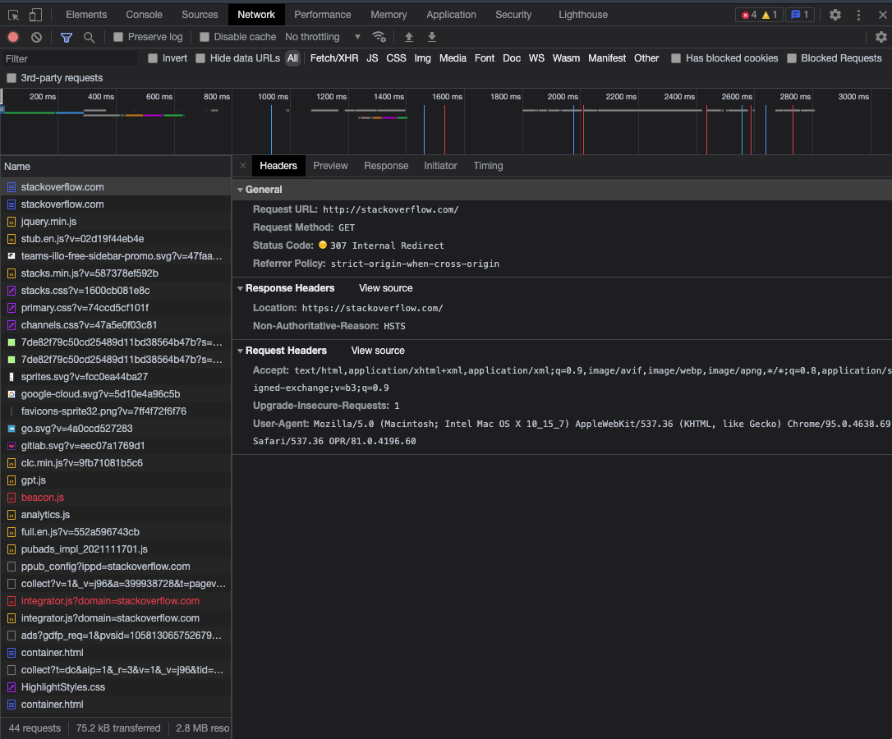
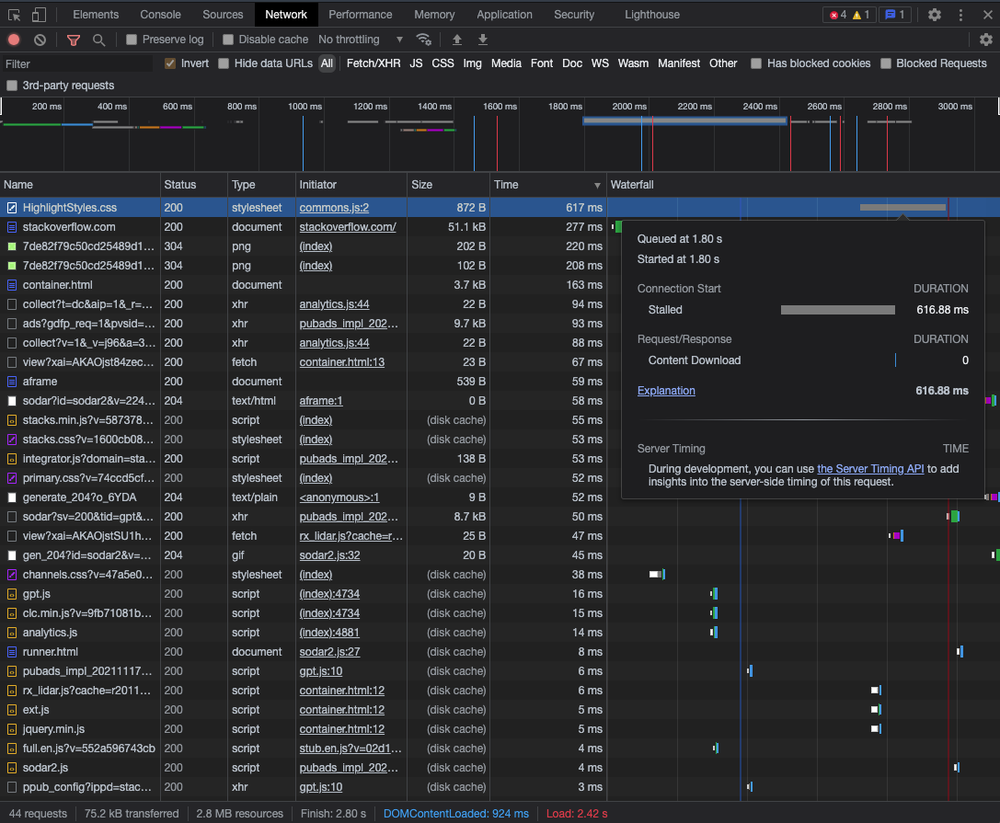

# Домашнее задание к занятию "3.6. Компьютерные сети, лекция 1"

1. Работа c HTTP через телнет.
- Подключитесь утилитой телнет к сайту stackoverflow.com
`telnet stackoverflow.com 80`
- отправьте HTTP запрос
```bash
GET /questions HTTP/1.0
HOST: stackoverflow.com
[press enter]
[press enter]
```
- В ответе укажите полученный HTTP код, что он означает?
```bash
vagrant@vagrant:~$ telnet stackoverflow.com 80
Trying 151.101.193.69...
Connected to stackoverflow.com.
Escape character is '^]'.
GET /questions HTTP/1.0
HOST: stackoverflow.com


HTTP/1.1 301 Moved Permanently
cache-control: no-cache, no-store, must-revalidate
location: https://stackoverflow.com/questions
x-request-guid: 914315ab-00e8-4dba-a540-101934173045
feature-policy: microphone 'none'; speaker 'none'
content-security-policy: upgrade-insecure-requests; frame-ancestors 'self' https://stackexchange.com
Accept-Ranges: bytes
Date: Thu, 02 Dec 2021 13:07:02 GMT
Via: 1.1 varnish
Connection: close
X-Served-By: cache-fra19179-FRA
X-Cache: MISS
X-Cache-Hits: 0
X-Timer: S1638450422.775265,VS0,VE475
Vary: Fastly-SSL
X-DNS-Prefetch-Control: off
Set-Cookie: prov=8bf44a17-0018-e745-75d9-7de60a5f615f; domain=.stackoverflow.com; expires=Fri, 01-Jan-2055 00:00:00 GMT; path=/; HttpOnly

Connection closed by foreign host.
```
Код состояния HTTP 301 или Moved Permanently — стандартный код ответа HTTP, получаемый в ответ от сервера в ситуации, когда запрошенный ресурс был на постоянной основе перемещён в новое месторасположение, и указывающий на то, что текущие ссылки, использующие данный URL, должны быть обновлены. Адрес нового месторасположения ресурса указывается в поле Location получаемого в ответ заголовка пакета протокола HTTP

2. Повторите задание 1 в браузере, используя консоль разработчика F12.
- откройте вкладку `Network`
- отправьте запрос http://stackoverflow.com
- найдите первый ответ HTTP сервера, откройте вкладку `Headers`
- укажите в ответе полученный HTTP код.
- проверьте время загрузки страницы, какой запрос обрабатывался дольше всего?
- приложите скриншот консоли браузера в ответ.

Status Code: 307 Internal Redirect



Время обработки самого долгого запроса 617 мс.




3. Какой IP адрес у вас в интернете?

```bash
vagrant@vagrant:~$ dig +short myip.opendns.com @resolver1.opendns.com
95.67.134...
```
4. Какому провайдеру принадлежит ваш IP адрес? Какой автономной системе AS? Воспользуйтесь утилитой `whois`

```bash
vagrant@vagrant:~$ whois 95.67.134.. | grep ^desc
descr:          samtel
descr:          Rostelecom networks
vagrant@vagrant:~$ whois 95.67.134.. | grep ^orig
origin:         AS12389
```

5. Через какие сети проходит пакет, отправленный с вашего компьютера на адрес 8.8.8.8? Через какие AS? Воспользуйтесь утилитой `traceroute`

```bash
vagrant@vagrant:~$ traceroute -An 8.8.8.8
traceroute to 8.8.8.8 (8.8.8.8), 30 hops max, 60 byte packets
 1  10.0.2.2 [*]  0.355 ms  0.630 ms  0.602 ms
 2  192.168.0.1 [*]  36.125 ms  35.647 ms  35.606 ms
 3  95.67.128.1 [AS12389]  35.565 ms  35.491 ms  35.467 ms
 4  213.59.233.192 [AS12389]  112.553 ms  112.462 ms  112.405 ms
 5  87.226.183.89 [AS12389]  90.109 ms 87.226.181.89 [AS12389]  89.994 ms 87.226.183.89 [AS12389]  89.956 ms
 6  5.143.253.105 [AS12389]  124.377 ms 74.125.51.172 [AS15169]  107.048 ms 5.143.253.245 [AS12389]  106.947 ms
 7  * 108.170.250.34 [AS15169]  39.864 ms 108.170.250.99 [AS15169]  39.811 ms
 8  142.251.49.158 [AS15169]  39.780 ms 172.253.66.116 [AS15169]  39.559 ms 209.85.255.136 [AS15169]  39.524 ms
 9  108.170.235.204 [AS15169]  39.407 ms 216.239.48.224 [AS15169]  39.384 ms  39.364 ms
10  142.250.210.103 [AS15169]  39.282 ms 172.253.70.49 [AS15169]  39.255 ms 172.253.51.247 [AS15169]  39.165 ms
11  * * *
12  * * *
13  * * *
14  * * *
15  * * *
16  * * *
17  * * *
18  * * *
19  * * *
20  * * 8.8.8.8 [AS15169]  224.842 ms
```
6. Повторите задание 5 в утилите `mtr`. На каком участке наибольшая задержка - delay?
```bash
vagrant@vagrant:~$ mtr 8.8.8.8 -znrc 1
Start: 2021-12-02T18:45:49+0000
HOST: vagrant                     Loss%   Snt   Last   Avg  Best  Wrst StDev
  1. AS???    10.0.2.2             0.0%     1    0.3   0.3   0.3   0.3   0.0
  2. AS???    192.168.0.1          0.0%     1   32.3  32.3  32.3  32.3   0.0
  3. AS12389  95.67.128.1          0.0%     1   14.4  14.4  14.4  14.4   0.0
  4. AS12389  213.59.233.192       0.0%     1   59.7  59.7  59.7  59.7   0.0
  5. AS12389  87.226.183.89        0.0%     1   64.3  64.3  64.3  64.3   0.0
  6. AS12389  5.143.253.245        0.0%     1   46.7  46.7  46.7  46.7   0.0
  7. AS15169  108.170.250.130      0.0%     1   68.0  68.0  68.0  68.0   0.0
  8. AS15169  142.251.49.78        0.0%     1  569.6 569.6 569.6 569.6   0.0
  9. AS15169  172.253.65.159       0.0%     1  531.8 531.8 531.8 531.8   0.0
 10. AS15169  216.239.58.67        0.0%     1  198.5 198.5 198.5 198.5   0.0
 11. AS???    ???                 100.0     1    0.0   0.0   0.0   0.0   0.0
 12. AS???    ???                 100.0     1    0.0   0.0   0.0   0.0   0.0
 13. AS???    ???                 100.0     1    0.0   0.0   0.0   0.0   0.0
 14. AS???    ???                 100.0     1    0.0   0.0   0.0   0.0   0.0
 15. AS???    ???                 100.0     1    0.0   0.0   0.0   0.0   0.0
 16. AS???    ???                 100.0     1    0.0   0.0   0.0   0.0   0.0
 17. AS???    ???                 100.0     1    0.0   0.0   0.0   0.0   0.0
 18. AS???    ???                 100.0     1    0.0   0.0   0.0   0.0   0.0
 19. AS???    ???                 100.0     1    0.0   0.0   0.0   0.0   0.0
 20. AS15169  8.8.8.8              0.0%     1  405.6 405.6 405.6 405.6   0.0
vagrant@vagrant:~$
```

Наибольшая задержка `569.6` у хоста `8. AS15169  142.251.49.78`


7. Какие DNS сервера отвечают за доменное имя dns.google? Какие A записи? воспользуйтесь утилитой `dig`
```bash
7. vagrant@vagrant:~$ dig +short NS dns.google
ns3.zdns.google.
ns2.zdns.google.
ns1.zdns.google.
ns4.zdns.google.
vagrant@vagrant:~$ dig +short A  dns.google
8.8.4.4
8.8.8.8
```

8. Проверьте PTR записи для IP адресов из задания 7. Какое доменное имя привязано к IP? воспользуйтесь утилитой `dig`

```bash
vagrant@vagrant:~$ for ip in `dig +short A dns.google`; do dig -x $ip | grep ^[0-9]; done
8.8.8.8.in-addr.arpa.	788	IN	PTR	dns.google.
4.4.8.8.in-addr.arpa.	1569	IN	PTR	dns.google.
```
