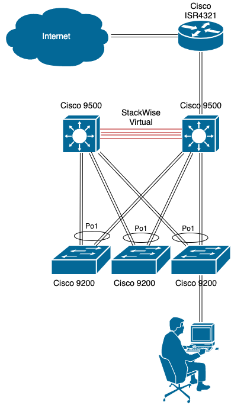

# Домашнее задание к занятию "3.8. Компьютерные сети, лекция 3"

1. Подключитесь к публичному маршрутизатору в интернет. Найдите маршрут к вашему публичному IP
```
telnet route-views.routeviews.org
Username: rviews
show ip route x.x.x.x/32
show bgp x.x.x.x/32
```

```bash
route-views>sh ip route 178.45.43.242 255.255.255.255
Routing entry for 178.44.0.0/14, supernet
  Known via "bgp 6447", distance 20, metric 0
  Tag 6939, type external
  Last update from 64.71.137.241 4d11h ago
  Routing Descriptor Blocks:
  * 64.71.137.241, from 64.71.137.241, 4d11h ago
      Route metric is 0, traffic share count is 1
      AS Hops 2
      Route tag 6939
      MPLS label: none
```
2. Создайте dummy0 интерфейс в Ubuntu. Добавьте несколько статических маршрутов. Проверьте таблицу маршрутизации.

```bash
root@vagrant:~# echo "dummy" > /etc/modules-load.d/dummy.conf
root@vagrant:~# echo "options dummy numdummies=2" > /etc/modprobe.d/dummy.conf
```

```bash
root@vagrant:~# cat /etc/systemd/network/10-dummy0.netdev
[NetDev]
Name=dummy0
Kind=dummy

root@vagrant:~# cat /etc/systemd/network/20-dummy0.network
[Match]
Name=dummy0

[Network]
Address=10.10.10.10/32
```
```bash
root@vagrant:~# systemctl restart systemd-networkd
root@vagrant:~# ip link list
...
3: dummy0: <BROADCAST,NOARP,UP,LOWER_UP> mtu 1500 qdisc noqueue state UNKNOWN mode DEFAULT group default qlen 1000
    link/ether ae:34:d4:b8:b8:7d brd ff:ff:ff:ff:ff:ff
```
```bash
root@vagrant:~# cat /etc/netplan/01-netcfg.yaml
network:
  version: 2
  ethernets:
    eth0:
      dhcp4: true
      routes:
        - to: 192.168.0.0/24
          via: 10.0.2.2

root@vagrant:~# ip route get 192.168.0.0
192.168.0.0 via 10.0.2.2 dev eth0 src 10.0.2.15 uid 0
    cache
```

3. Проверьте открытые TCP порты в Ubuntu, какие протоколы и приложения используют эти порты? Приведите несколько примеров.

```bash
root@vagrant:~# ss -tnlp
State     Recv-Q    Send-Q       Local Address:Port         Peer Address:Port    Process
LISTEN    0         4096               0.0.0.0:111               0.0.0.0:*        users:(("rpcbind",pid=615,fd=4),("systemd",pid=1,fd=102))
LISTEN    0         4096         127.0.0.53%lo:53                0.0.0.0:*        users:(("systemd-resolve",pid=616,fd=13))
LISTEN    0         128                0.0.0.0:22                0.0.0.0:*        users:(("sshd",pid=2133,fd=3))
LISTEN    0         4096                  [::]:111                  [::]:*        users:(("rpcbind",pid=615,fd=6),("systemd",pid=1,fd=104))
LISTEN    0         128                   [::]:22                   [::]:*        users:(("sshd",pid=2133,fd=4))
```

- 53 порт - DOMAIN (Domain Name System, DNS)
- 22 порт - SSH (Secure SHell)
- 111 порт - Remote Procedure Call

4. Проверьте используемые UDP сокеты в Ubuntu, какие протоколы и приложения используют эти порты?

```bash
root@vagrant:~# ss -unap
State     Recv-Q    Send-Q        Local Address:Port        Peer Address:Port    Process
UNCONN    0         0             127.0.0.53%lo:53               0.0.0.0:*        users:(("systemd-resolve",pid=616,fd=12))
UNCONN    0         0            10.0.2.15%eth0:68               0.0.0.0:*        users:(("systemd-network",pid=14427,fd=22))
UNCONN    0         0                   0.0.0.0:111              0.0.0.0:*        users:(("rpcbind",pid=615,fd=5),("systemd",pid=1,fd=103))
UNCONN    0         0                      [::]:111                 [::]:*        users:(("rpcbind",pid=615,fd=7),("systemd",pid=1,fd=105))
```

- 68 порт - BOOTPC (Bootstrap Protocol Client), а так же DHCP.

5. Используя diagrams.net, создайте L3 диаграмму вашей домашней сети или любой другой сети, с которой вы работали. 


