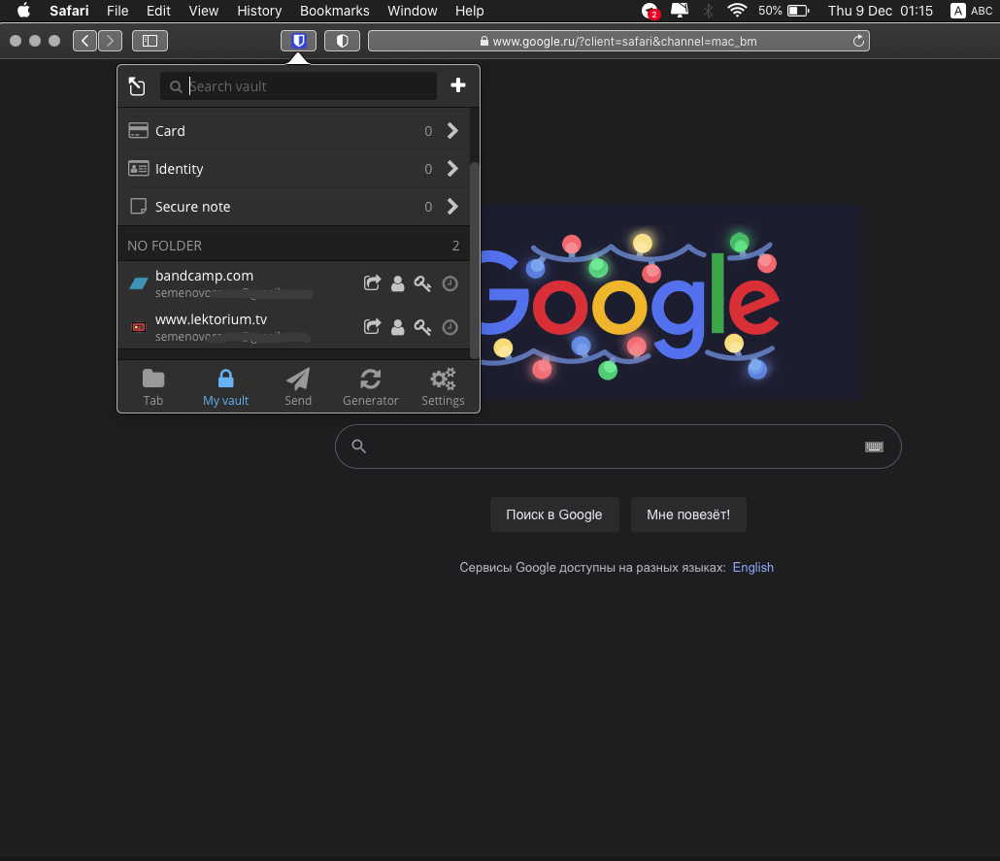
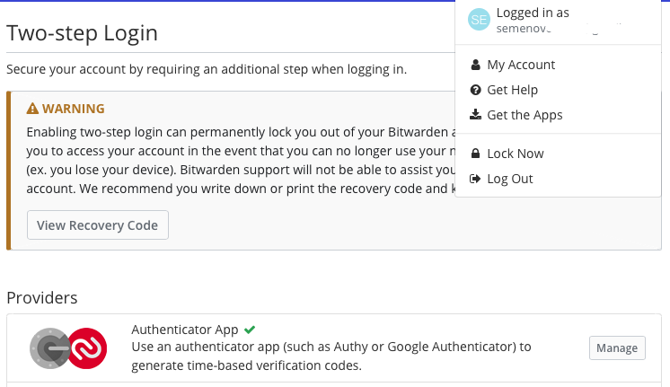
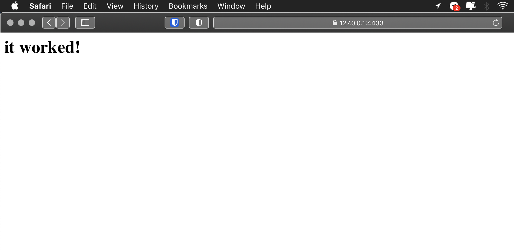
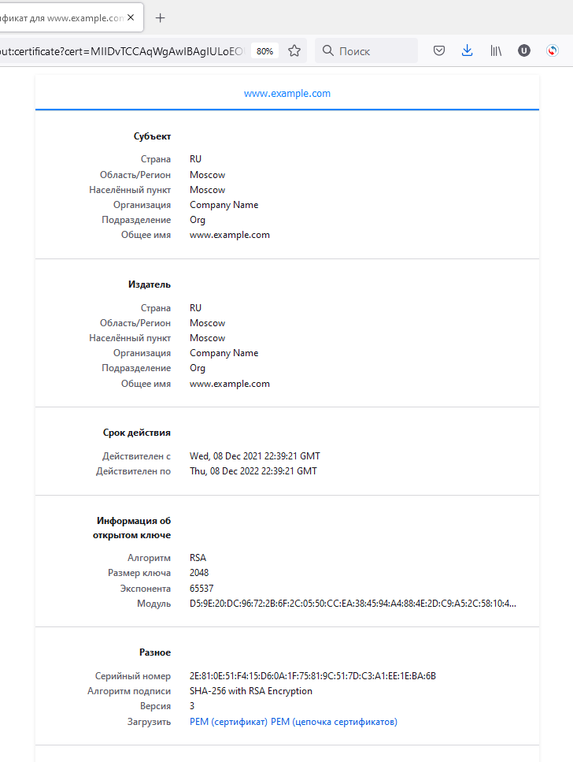
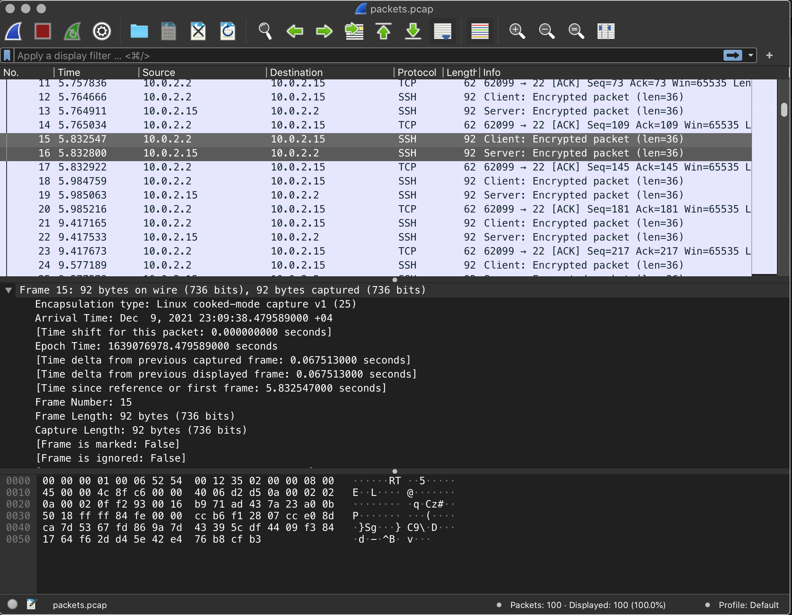

# Домашнее задание к занятию "3.9. Элементы безопасности информационных систем"

1. Установите Bitwarden плагин для браузера. Зарегестрируйтесь и сохраните несколько паролей.



2. Установите Google authenticator на мобильный телефон. Настройте вход в Bitwarden акаунт через Google authenticator OTP.



3. Установите apache2, сгенерируйте самоподписанный сертификат, настройте тестовый сайт для работы по HTTPS.

```bash
vagrant@vagrant:~$ sudo apt install apache2
vagrant@vagrant:~$ sudo a2enmod ssl
vagrant@vagrant:~$ sudo systemctl restart apache2
vagrant@vagrant:~$ sudo openssl req -x509 -nodes -days 365 -newkey rsa:2048 \
> -keyout /etc/ssl/private/apache-selfsigned.key \
> -out /etc/ssl/certs/apache-selfsigned.crt \
> -subj "/C=RU/ST=Moscow/L=Moscow/O=Company Name/OU=Org/CN=www.example.com"
Generating a RSA private key
....+++++
..........+++++
writing new private key to '/etc/ssl/private/apache-selfsigned.key'
-----
vagrant@vagrant:~$
```

```bash
root@vagrant:~# vim /etc/apache2/sites-available/example.conf
<IfModule mod_ssl.c>
<VirtualHost *:443>
   ServerName example.com
   DocumentRoot /var/www/example.com
   SSLEngine on
   SSLCertificateFile /etc/ssl/certs/apache-selfsigned.crt
   SSLCertificateKeyFile /etc/ssl/private/apache-selfsigned.key
</VirtualHost>
</IfModule>
```

```bash 
root@vagrant:~# mkdir /var/www/example.com/
root@vagrant:~# vim /var/www/example.com/index.html
root@vagrant:~# <h1>it worked!</h1>
root@vagrant:~# a2ensite example.conf
Enabling site example.
To activate the new configuration, you need to run:
  systemctl reload apache2
root@vagrant:~# apache2ctl configtest
Syntax OK
root@vagrant:~# systemctl reload apache2
```




4. Проверьте на TLS уязвимости произвольный сайт в интернете (кроме сайтов МВД, ФСБ, МинОбр, НацБанк, РосКосмос, РосАтом, РосНАНО и любых госкомпаний, объектов КИИ, ВПК ... и тому подобное).

```bash
vagrant@vagrant:~/01/testssl.sh$ ./testssl.sh -U --sneaky https://www.google.com/
 Testing vulnerabilities

 Heartbleed (CVE-2014-0160)                not vulnerable (OK), no heartbeat extension
 CCS (CVE-2014-0224)                       not vulnerable (OK)
 Ticketbleed (CVE-2016-9244), experiment.  not vulnerable (OK)
 ROBOT                                     not vulnerable (OK)
 Secure Renegotiation (RFC 5746)           supported (OK)
 Secure Client-Initiated Renegotiation     not vulnerable (OK)
 CRIME, TLS (CVE-2012-4929)                not vulnerable (OK)
 BREACH (CVE-2013-3587)                    potentially NOT ok, "br gzip" HTTP compression detected. - only supplied "/" tested
                                           Can be ignored for static pages or if no secrets in the page
 POODLE, SSL (CVE-2014-3566)               not vulnerable (OK)
 TLS_FALLBACK_SCSV (RFC 7507)              Downgrade attack prevention supported (OK)
 SWEET32 (CVE-2016-2183, CVE-2016-6329)    VULNERABLE, uses 64 bit block ciphers
 FREAK (CVE-2015-0204)                     not vulnerable (OK)
 DROWN (CVE-2016-0800, CVE-2016-0703)      not vulnerable on this host and port (OK)
                                           make sure you don't use this certificate elsewhere with SSLv2 enabled services
                                           https://censys.io/ipv4?q=0516FD03EBFF434893543847CDDEA0539468FD1DC0B7D9FDAB97989CD9F200FE could help you to find out
 LOGJAM (CVE-2015-4000), experimental      not vulnerable (OK): no DH EXPORT ciphers, no DH key detected with <= TLS 1.2
 BEAST (CVE-2011-3389)                     TLS1: ECDHE-ECDSA-AES128-SHA ECDHE-ECDSA-AES256-SHA ECDHE-RSA-AES128-SHA ECDHE-RSA-AES256-SHA
                                                 AES128-SHA AES256-SHA DES-CBC3-SHA
                                           VULNERABLE -- but also supports higher protocols  TLSv1.1 TLSv1.2 (likely mitigated)
 LUCKY13 (CVE-2013-0169), experimental     potentially VULNERABLE, uses cipher block chaining (CBC) ciphers with TLS. Check patches
 Winshock (CVE-2014-6321), experimental    not vulnerable (OK)
 RC4 (CVE-2013-2566, CVE-2015-2808)        no RC4 ciphers detected (OK)

```

5. Установите на Ubuntu ssh сервер, сгенерируйте новый приватный ключ. Скопируйте свой публичный ключ на другой сервер. Подключитесь к серверу по SSH-ключу.
 
```bash
root@vagrant:~# ssh-keygen
Generating public/private rsa key pair.
root@vagrant:~# ls -l .ssh/
total 12
-rw------- 1 root root 2602 Dec  9 16:40 id_rsa
-rw-r--r-- 1 root root  566 Dec  9 16:40 id_rsa.pub
-rw-r--r-- 1 root root  222 Dec  9 15:51 known_hosts
```
```bash
root@vagrant:~# ssh-copy-id  -i .ssh/id_rsa vagrant@192.168.0.101
/usr/bin/ssh-copy-id: INFO: Source of key(s) to be installed: ".ssh/id_rsa.pub"
/usr/bin/ssh-copy-id: INFO: attempting to log in with the new key(s), to filter out any that are already installed
/usr/bin/ssh-copy-id: INFO: 1 key(s) remain to be installed -- if you are prompted now it is to install the new keys
vagrant@192.168.0.101's password:

Number of key(s) added: 1

Now try logging into the machine, with:   "ssh 'vagrant@192.168.0.101'"
and check to make sure that only the key(s) you wanted were added.
```
6. Переименуйте файлы ключей из задания 5. Настройте файл конфигурации SSH клиента, так чтобы вход на удаленный сервер осуществлялся по имени сервера.


```bash
root@vagrant:~# mv .ssh/id_rsa .ssh/new_id_rsa
root@vagrant:~# mv .ssh/id_rsa.pub .ssh/new_id_rsa.pub
root@vagrant:~# cat .ssh/config
Host hostbyname
    Hostname 192.168.0.101
    IdentityFile /root/.ssh/new_id_rsa

root@vagrant:~# ssh vagrant@hostbyname
Welcome to Ubuntu 20.04.2 LTS (GNU/Linux 5.4.0-80-generic x86_64)

 * Documentation:  https://help.ubuntu.com
 * Management:     https://landscape.canonical.com
 * Support:        https://ubuntu.com/advantage

  System information as of Thu 09 Dec 2021 07:23:08 PM UTC

  System load:  0.0               Processes:             109
  Usage of /:   2.4% of 61.31GB   Users logged in:       0
  Memory usage: 15%               IPv4 address for eth0: 10.0.2.15
  Swap usage:   0%                IPv4 address for eth1: 192.168.0.101


This system is built by the Bento project by Chef Software
More information can be found at https://github.com/chef/bento
Last login: Thu Dec  9 18:51:12 2021 from 192.168.0.95
vagrant@vagrant:~$
```

7. Соберите дамп трафика утилитой tcpdump в формате pcap, 100 пакетов. Откройте файл pcap в Wireshark.

```bash
vagrant@vagrant:~$ sudo tcpdump -nnei any -c 100 -w packets.pcap
tcpdump: listening on any, link-type LINUX_SLL (Linux cooked v1), capture size 262144 bytes
100 packets captured
104 packets received by filter
0 packets dropped by kernel
```


8*. Просканируйте хост scanme.nmap.org. Какие сервисы запущены?


```bash 
vagrant@vagrant:~$ nmap scanme.nmap.org
Starting Nmap 7.80 ( https://nmap.org ) at 2021-12-09 19:19 UTC
Nmap scan report for scanme.nmap.org (45.33.32.156)
Host is up (0.29s latency).
Not shown: 985 closed ports
PORT      STATE    SERVICE
22/tcp    open     ssh
80/tcp    open     http
544/tcp   filtered kshell
548/tcp   filtered afp
990/tcp   filtered ftps
2557/tcp  filtered nicetec-mgmt
2604/tcp  filtered ospfd
2701/tcp  filtered sms-rcinfo
3031/tcp  filtered eppc
3333/tcp  filtered dec-notes
8042/tcp  filtered fs-agent
9929/tcp  open     nping-echo
16000/tcp filtered fmsas
31337/tcp open     Elite
32775/tcp filtered sometimes-rpc13
```
9*. Установите и настройте фаервол ufw на web-сервер из задания 3. Откройте доступ снаружи только к портам 22,80,443

```bash
root@vagrant:~# ufw status verbose
Status: active
Logging: on (low)
Default: deny (incoming), allow (outgoing), disabled (routed)
New profiles: skip

To                         Action      From
--                         ------      ----
22/tcp (OpenSSH)           ALLOW IN    Anywhere
80,443/tcp (Apache Full)   ALLOW IN    Anywhere
22/tcp (OpenSSH (v6))      ALLOW IN    Anywhere (v6)
80,443/tcp (Apache Full (v6)) ALLOW IN    Anywhere (v6)
```