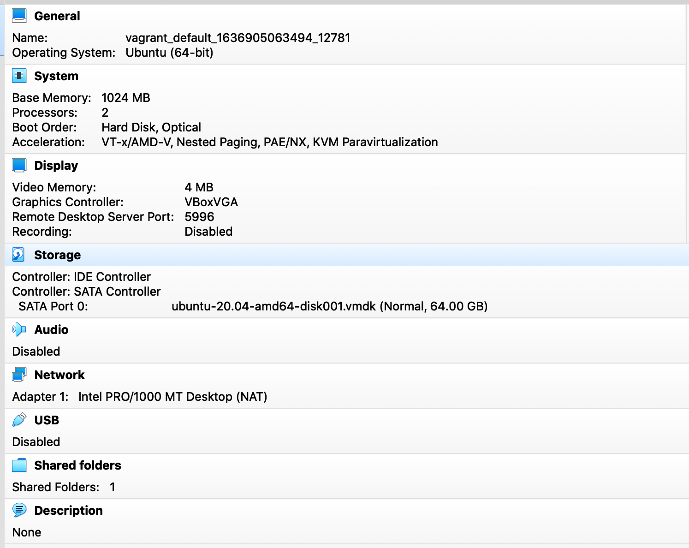

# Домашнее задание к занятию "3.1. Работа в терминале, лекция 1"


5. Ознакомьтесь с графическим интерфейсом VirtualBox, посмотрите как выглядит виртуальная машина, которую создал для вас Vagrant, какие аппаратные ресурсы ей выделены. Какие ресурсы выделены по-умолчанию?



6. Ознакомьтесь с возможностями конфигурации VirtualBox через Vagrantfile: [документация](https://www.vagrantup.com/docs/providers/virtualbox/configuration.html). Как добавить оперативной памяти или ресурсов процессора виртуальной машине?

```buildoutcfg
config.vm.provider "virtualbox" do |v|
  v.memory = 1024
  v.cpus = 2
end

```

7. Команда `vagrant ssh` из директории, в которой содержится Vagrantfile, позволит вам оказаться внутри виртуальной машины без каких-либо дополнительных настроек. Попрактикуйтесь в выполнении обсуждаемых команд в терминале Ubuntu.

8. Ознакомиться с разделами `man bash`, почитать о настройках самого bash:
    * какой переменной можно задать длину журнала `history`, и на какой строчке manual это описывается?
    * что делает директива `ignoreboth` в bash?


`HISTFILESIZE`	Максимальное количество строк, содержащееся в файле истории. Если этой переменной присвоено значение, файл истории, при необходимости, усекается, и будет содержать не больше, чем указанное количество строк. Стандартное значение - 500. Файл истории также усекается до этого размера после записи при выходе из интерактивного командного интерпретатора. `Manual page bash(1) line 758`

`HISTSIZE`	Количество команд, которые необходимо запоминать в списке истории. Стандартное значение - 500. `Manual page bash(1) line 771`

Параметр переменной `HISTCONTROL` - `ignoreboth` означает не записывать команду, которая начинается с пробела, или команду, которая дублирует предыдущую.

9. В каких сценариях использования применимы скобки `{}` и на какой строчке `man bash` это описано?

Замена выражений в фигурных скобках (Brace Expansion) - это механизм генерации произвольных строк. Он аналогичен подстановке имен файлов, но генерируемые имена
не обязательно должны существовать. Шаблоны в фигурных скобках имеют вид необязательного префикса, за которым идет набор строк через запятую в фигурных
скобках, после чего - необязательный суффикс. Префикс добавляется в начало каждой строки, содержащейся в фигурных скобках, а затем к каждой полученной
так (слева направо) строке добавляется суффикс.

Выражения в фигурных скобках могут быть вложенными. Результаты каждой замены не сортируются; порядок слева направо сохраняется. Например, конструкция

`a{d,c,b}e `заменяется на `'ade ace abe'`.

`Manual page bash(1) line 979`

10. С учётом ответа на предыдущий вопрос, как создать однократным вызовом `touch` 100000 файлов? Получится ли аналогичным образом создать 300000? Если нет, то почему?

```buildoutcfg
vagrant@vagrant:~$ touch file{000001..100000}
```
```buildoutcfg
vagrant@vagrant:~$ touch file{000001..300000}
-bash: /usr/bin/touch: Argument list too long
```

11. В man bash поищите по `/\[\[`. Что делает конструкция `[[ -d /tmp ]]`

Kонструкция `[[ -d /tmp ]]` - проверяет существование каталога `/tmp` и возвращает статус 0, если существует и 1 если нет.


12. Основываясь на знаниях о просмотре текущих (например, PATH) и установке новых переменных; командах, которые мы рассматривали, добейтесь в выводе type -a bash в виртуальной машине наличия первым пунктом в списке:

     ```bash
     bash is /tmp/new_path_directory/bash
     bash is /usr/local/bin/bash
     bash is /bin/bash
     ```

     (прочие строки могут отличаться содержимым и порядком)
     В качестве ответа приведите команды, которые позволили вам добиться указанного вывода или соответствующие скриншоты.

```buildoutcfg
vagrant@vagrant:~$ mkdir /tmp/new_path_directory/; cp /bin/bash /tmp/new_path_directory/
vagrant@vagrant:~$ PATH=/tmp/new_path_directory/:$PATH
vagrant@vagrant:~$ type -a bash
bash is /tmp/new_path_directory/bash
bash is /tmp/new_path_directory/bash
bash is /usr/bin/bash
bash is /bin/bash
```

13. Чем отличается планирование команд с помощью `batch` и `at`?

Команда `at` используется для назначения одноразового задания на заданное время, а команда `batch` — для назначения одноразовых задач, которые должны выполняться, когда загрузка системы становится меньше 1.5

14. Завершите работу виртуальной машины чтобы не расходовать ресурсы компьютера и/или батарею ноутбука.

 
 ---

